# Standard Operating Procedures of Expense

App Expense is created by Dongjun Yang for best practices in running expense process on platform of smart_office.

# Expense basic workflow

## Flow diagram:

## Expense user stories
Apart from basic work flow( submitting the request, approving or rejecting the form, editing the expense form) showed above, the other features are lied below and details are in the next section:

### As an employee
When I login I shall be able to view the expense-history list that I applied before.

### As a non-requestor employee
I'm supposed to receive Emails that inform me to check the expense form that need my review.
When I login I shall be able to view the expense list that waiting for me to check.
When I'm checking the expense form, I should be able to add one more general employee*, except for those alreay in the approving list or the request themselves, behind or ahead of me to 
check this form.
When I think someone else should be responsible for this process instead of me, I can replace me with them as a general employee* so I don't need to check this form anymore.
I may have right to do partial approving. 

### As a non-requestor employee( accountant)
Besides features listed above, the accountant is able to edit some fields of this form and shall define each item as either expense or item.

*general employee here means an employee who can't perform special role in our platform. e.g an accountant, under this circumstance even if this employee is an accountant and been added into the process
list, they will not be able to edit the form, only the accountant we defined in our configuration table has that permission. 

# Details of the standard procedure

## Universal pages:
**Dashboard:**
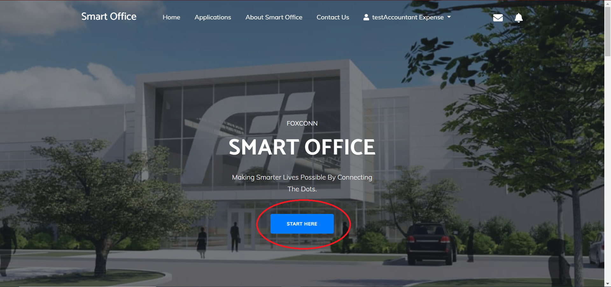
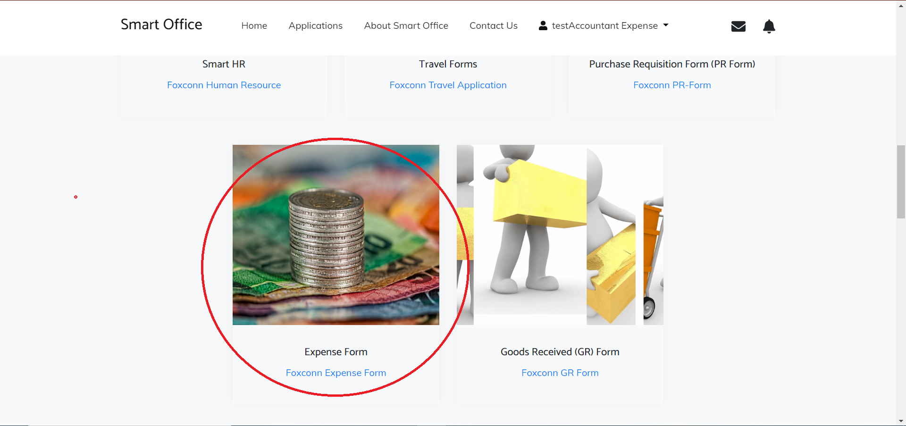
 
By clicking the Expense pannel, the broswer will redirect you to the Expense page:
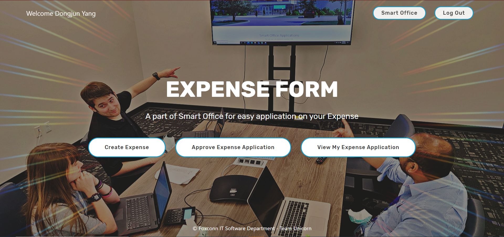

## Genral employee( requestor):
To create an expense request, just simply click on "Create Expense" button at expense homepage, and fill in all information needed at following page.
All existed fields are required, and in order to have a complete process, you'll define the checking unit. So you have to select a company at frst: 
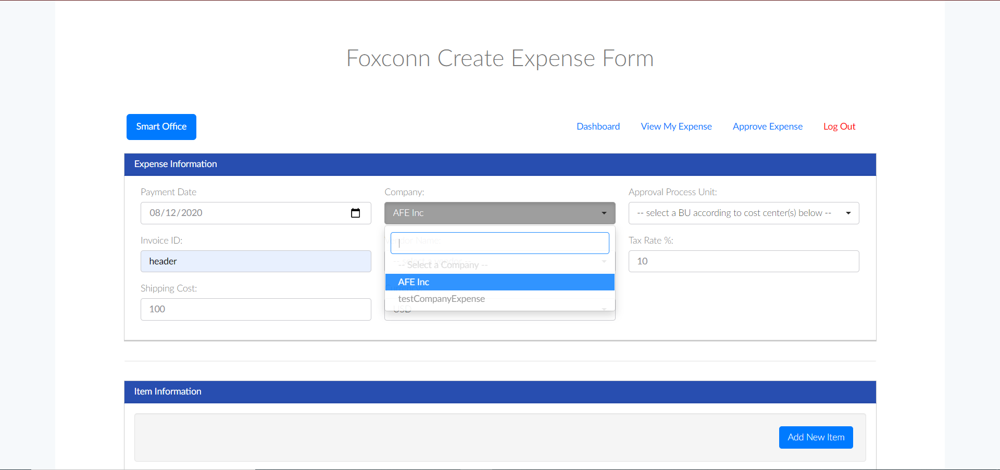 
Then, select cost center for each item based on company you selected: 
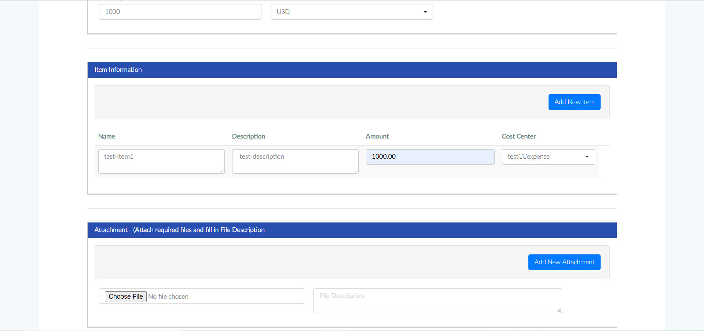 
Finally, select the BU that you think should go to process this expense request according to cost center(s) you selected before and make sure all other fields are there before you submit the form( but don't worry about that, our app will alert you if you try to submit it with some blank fields):
 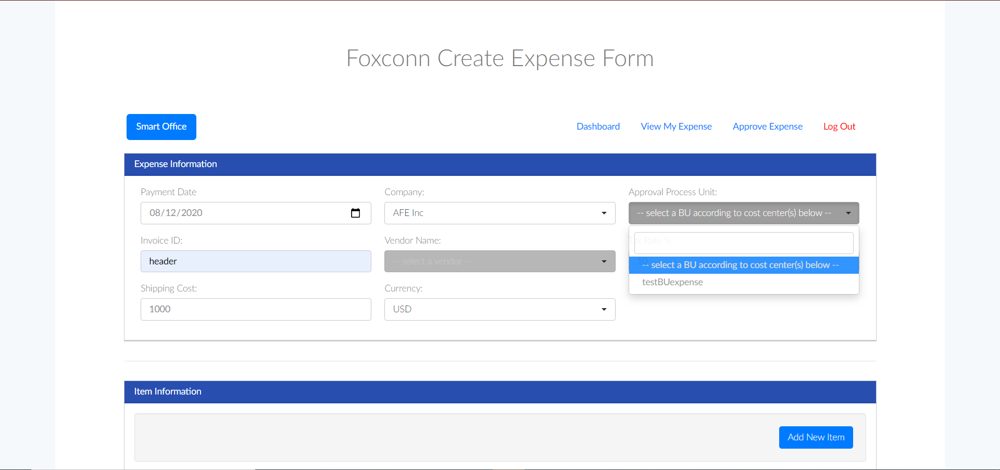 
After you submitted the form, you'll be led to our expense_homepage again, then click on the "View My Expense Application" button to view your expense application history: 
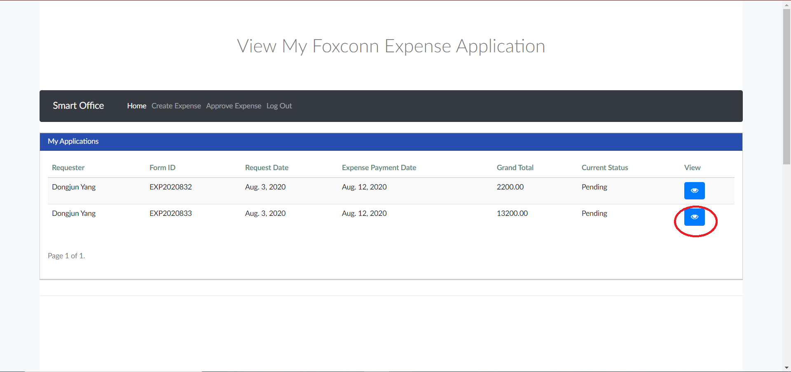 
Click on the button highlighted above you can see the detail of your expense form, and we can see additional information of the processing status at the bottom: 
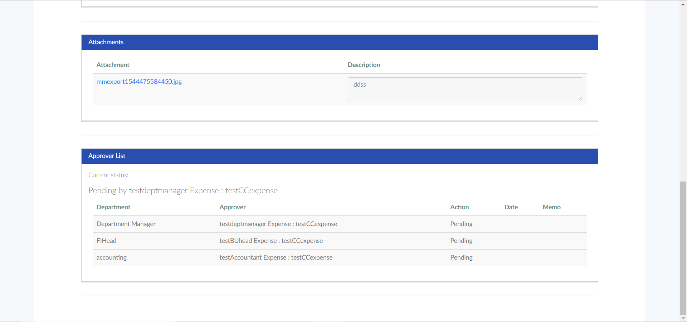 

## Genral employee:
If you are involved in a process, you'll receive an Email, you can click on the link to view or just click on the "Approve Expense Application" at expense homepage to see it: 
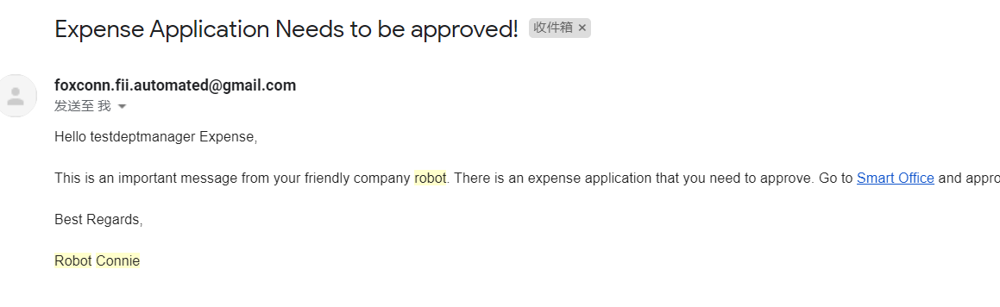 
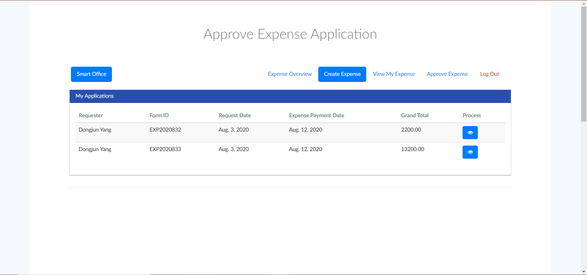 
And at here you can either approve or reject the expense request : 
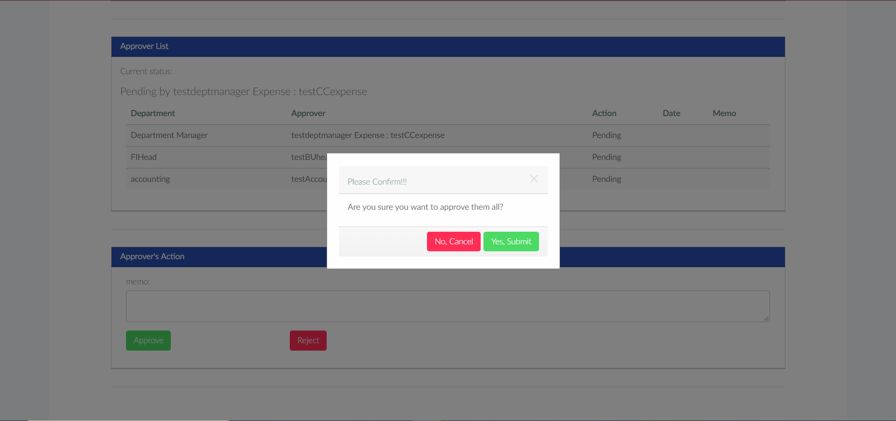 
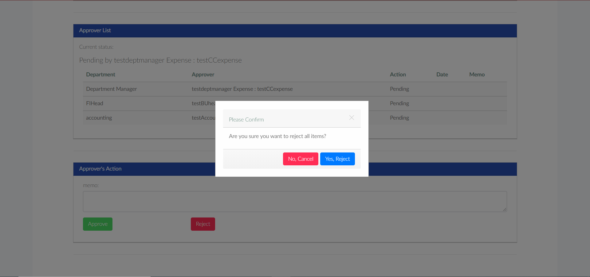 
If you are not the department manager of this expense, you will be able to replace yourself or add one employee to view this form( because a department manager is obligate to check the item under their cost center, they don't have choice to replace or add one person ahead them)
Click "Replace Me" at the bottom to replace yourself: 
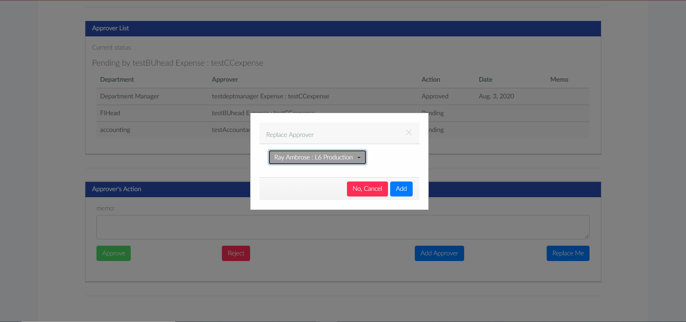 
Click "Add Approver" at the bottom to add one more appover: 
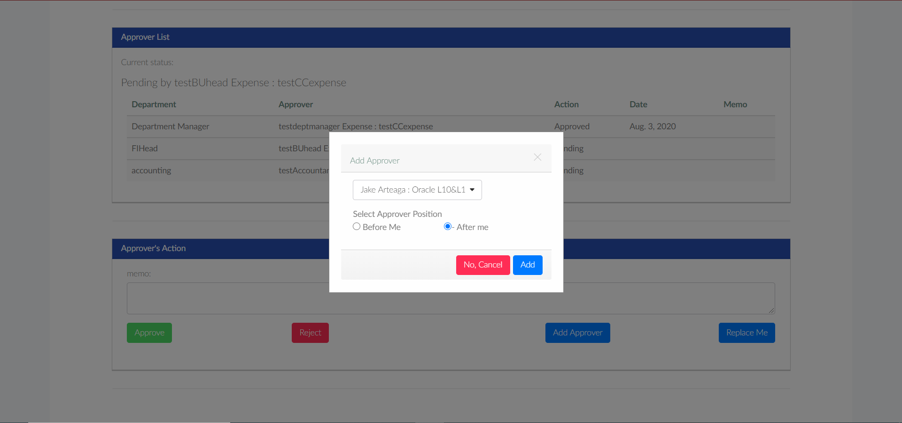 
And if you have the right to partial approve the items, you will be able to check those invalid item you are not gonna approve, and then click on the "Approve" button to approve the rest:
 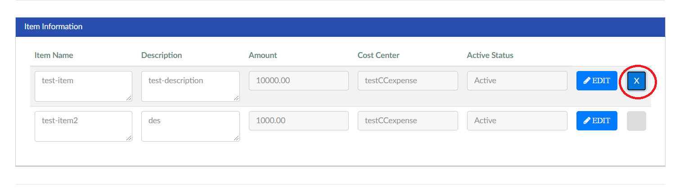 
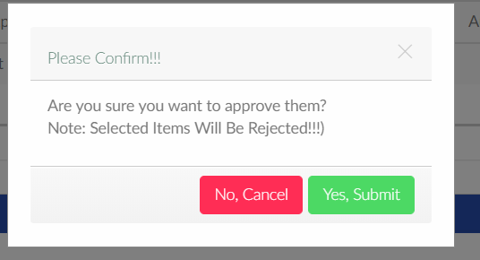 

## Accountant:
If you are an accountant in this process list, then you are the backbone to finish the final step: to input neccessary information to record the expense form into SAP system.
First of all, you can still perform approve, reject, add approver, but sine you are the final one, so you can only add an approver before you: 
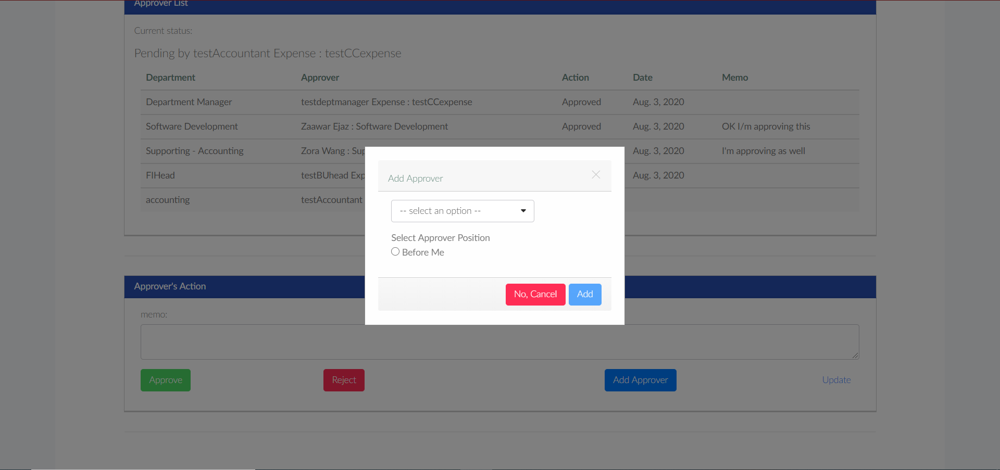 
And you **must** add a document header for this form: 
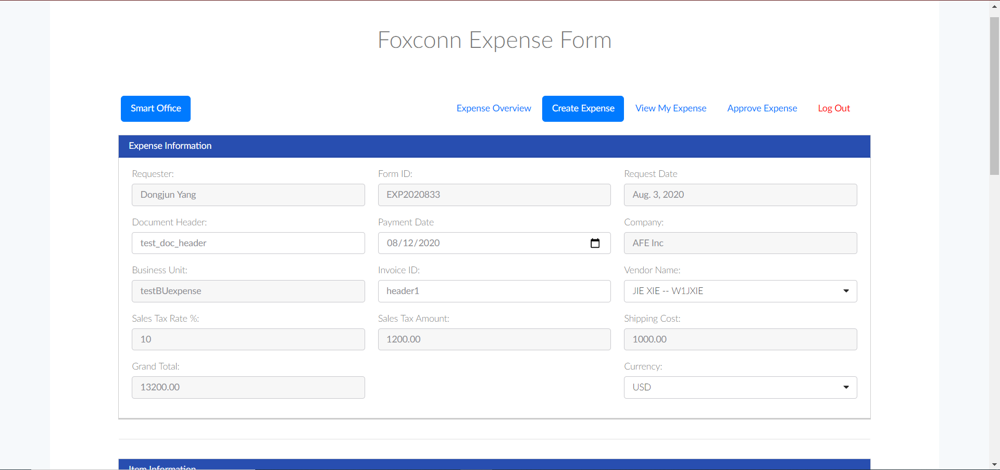 
And you **must** define each item by clicking here: 
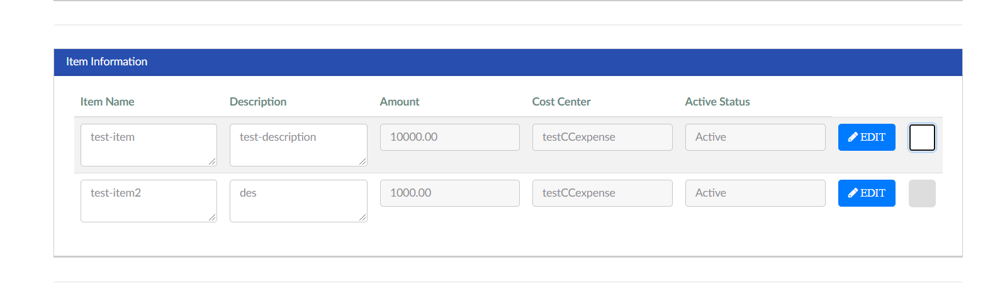 
Choose the type: 
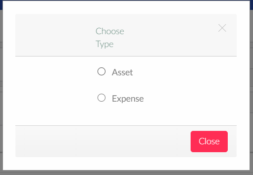 
If it's an asset, type in the asset number for it: 
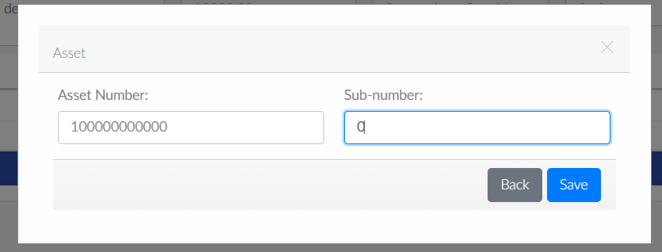 
If it's an expense, input the right information: 
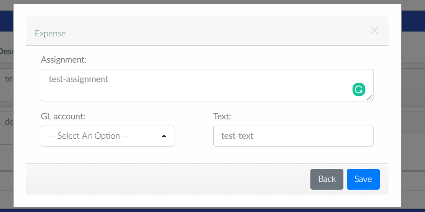 
Once you are done with modification, you can click on the "Update" button to save your change, remember not to let any field be blank. And if you are sure your change is correct, 
you can just not using "Update" but "Approve" button, which will also save the change is all fields are valid, the only difference is that you can't modify it anymore once you approve the form.

